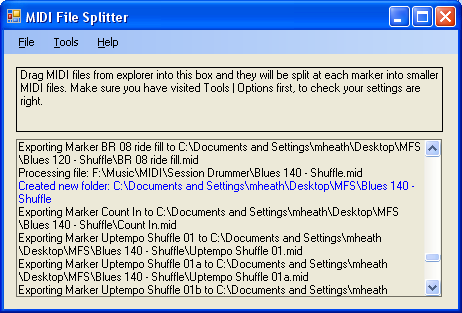
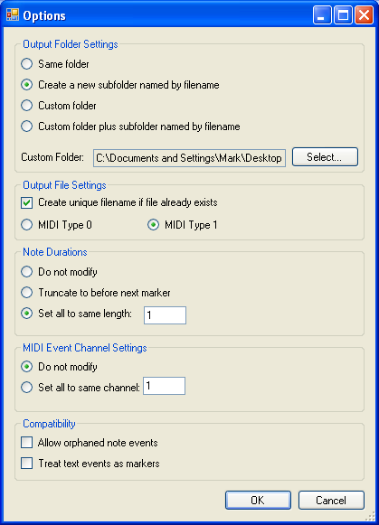
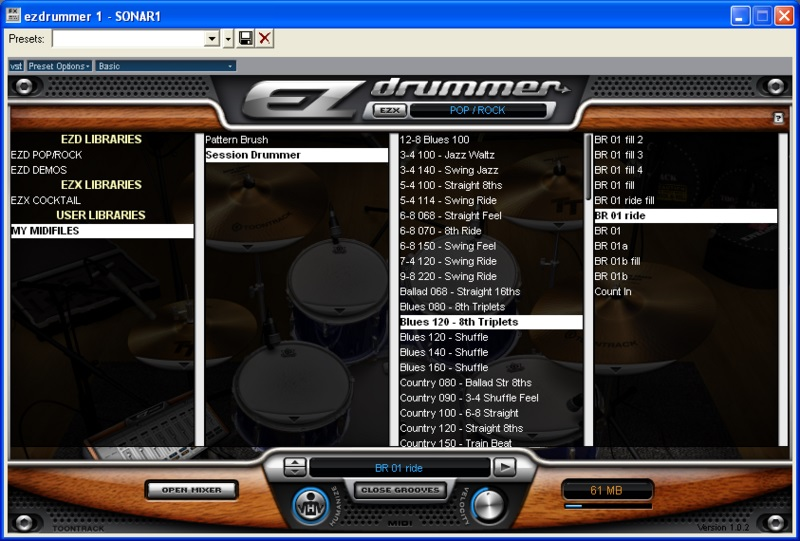

## MIDI File Splitter

MIDI File Splitter is a simple utility designed to split a MIDI file up into multiple sections based on its markers. It was designed to be used for splitting up the Session Drummer and Pattern Brush MIDI files included with [Cakewalk's SONAR](http://www.cakewalk.com) into individual patterns so that they can be dragged and dropped easily one at a time into SONAR's track view.

Splitting the files is as simple as selecting the files you want to split in Windows Explorer and dragging them into the rectangular area at the top of the MIDI File Splitter window (alternatively you can click the "Load" button). By default, a new folder will be created to contain each marker's file, with each file being named after the marker. You can also choose for the files not to be placed in a subfolder, or to all go to a specified custom folder (this will default to your desktop).

MIDI File Splitter has a detailed output window that shows you exactly what files it is creating, and reports any errors it encounters (look for messages in Red). MIDI File Splitter will never overwrite an existing file, but you can ask it to generate a new unique filename if the file it is trying to create already exists.

MIDI File Splitter is beta software and may contain some bugs. Please do check that the output files it creates are what you expected. If you encounter any bugs, or have any feature requests, please report them on the issues tab

## Download

A link to the latest version of MIDI File Splitter can be found [here](https://github.com/markheath/midifilesplitter/releases)

## Installation and Requirements

MIDI File Splitter requires the .NET framework version 2.0 or greater to be installed. You can download this [here](http://msdn.microsoft.com/netframework/downloads/updates/default.aspx). Once you have the .NET framework installed on your PC, all you need to do is download and run the installer.

## Options

The options dialog allows you to customise the behaviour of MIDI File Splitter.

* **Output Folder Settings**
	* Use these settings to customise where the created MIDI files are placed. If you are planning to drag and drop lots of MIDI files at once, you will probably want one of the options that creates subfolders to help you organize your MIDI file collection.
	* _Same Folder_ - This will put the created MIDI files in the same folder as the source MIDI file.
	* _Create a new Subfolder_ - This will create a new subfolder in the same location as the input MIDI file, with the same name as the input MIDI file. 
	* _Custom Folder_ - This will put all created MIDI files into a user specified folder
	* _Custom Folder plus subfolder_ - This will put all created MIDI files in a subfolder under the specified custom folder. The subfolder will be given the same name as the input MIDI file.
	* _Browse_ - Click browse to select the folder you want MIDI files to be placed into
* **Output File Settings**
	* _Create Unique Filename_ - Sometimes there are two markers with the same name. Select this option to ensure that both get exported. MIDI File Splitter will add a number in brackets to the end of the filename. (note: after 100 attempts, MIDI File Splitter will give up trying to create a unique filename)
	* _MIDI File Type_ - If you plan to use this with SONAR 5 or earlier, select type 1 so that clips are named properly when they are dragged in. In SONAR 6, type 0 files will also be named correctly, so you have a choice, although SONAR can create multiple tracks when dragging in a type 0 file if its note events are not on MIDI channel 1.
* **Note Durations**
	* _Do not modify_ - The default setting. Note durations will not be modified.
	* _Truncate to before next marker_ - Ensures that no notes end on or after the next marker. This is so that programs such as EZdrummer do not interpret them as lasting a measure longer than they do. (Note that if a note starts exactly one tick before the end marker, then it will be given a duration of 1, not zero.)
	* _Set all to fixed length_ - allows you to change the durations of all notes to a set length. Only really useful for drum patterns, where you might want all notes to have a duration of 1.
* **MIDI Event Channel Settings**
	* _Do not modify_ - The default setting. MIDI event channels will not be modified.
	* _Set all to same channel_ - Puts all notes on the same MIDI channel (can be 1 to 16). Note that by convention, in MIDI, drums are on channel 10.
* **MIDI File Compatibility**
	* _Allow orphaned note events_ - Turn this on if you have some MIDI files which have Note Ons without corresponding note Offs, or note offs that don't belong to a note on. These should not be present in a well-formed MIDI file, but some commercial MIDI files have this problem.
	* _Treat text events as markers_ - Turn this on if you have some MIDI files which have MIDI Text events instead of MIDI Marker events. The MIDI will be split at text events.
	* _Treat lyrics as markers_ - Turn this on if you want to use MIDI lyric events for your split points. May be useful for users of Sibelius.

## Notes

* Is designed to work with MIDI type 1 files. (Type 0 will probably work OK as well)
* Will not split files that have no markers (to avoid people calling it on its own output)
* Will always put note-off messages in the same file as their note-on even if they fall after the next marker
* Will insert the latest tempo, key signature and time signature, allowing splitting of files whose tempos, key signatures and time signatures change.
* Track 1 will be given the marker name as a track name so that the clip is given this name when it is dropped into the track view in SONAR (even works when dragging from EZdrummer in SONAR 5).
* Copes correctly with clips whose first event does not fall exactly on the marker.
* Has been tested with Session Drummer and Pattern Brush MIDI files
* EZdrummer will play a measure of silence after some of these patterns. Use the truncate feature, or set note lengths to something short to fix this problem.

## Using SONAR patterns in EZdrummer

Here is a step by step guide on how to make use of the Session Drummer and Pattern Brush patterns in [EZdrummer](http://www.ezdrummer.com/index.asp).

 * Select one of the output options in MIDI File Splitter that will create files in subfolders
 * You may also want to select to set all MIDI note durations to 1, and all MIDI events to channel 1 to improve compatibility between EZdrummer and SONAR.
 * In Windows Explorer, browse to the Session Drummer's Drum Styles folder. (On my computer this is: _C:\Program Files\Cakewalk\Shared MIDI Plugins_)
 * Select all the files and drag them into MIDI File Splitter
 * Take all the created folders of MIDI files and put them into the EZdrummer _My Midi Files_ folder, perhaps under another subdirectory called "Session Drummer". (e.g. _C:\Program Files\Toontrack\EZDrummer\Midi\MY MIDIFILES\Session Drummer_)
 * Now browse to the Pattern Brush Patterns folder (On my computer this is _C:\Program Files\Cakewalk\SONAR 5 Studio Edition\Pattern Brush Patterns_)
 * Select all and drag them into MIDI File Splitter
 * Again take all the created folders and put them into EZdrummer's My MIDI files folder, under a different subdirectory. (e.g _C:\Program Files\Toontrack\EZDrummer\Midi\MY MIDIFILES\Pattern Brush_)

## Version History

New versions of MIDI File Splitter can be found at [https://github.com/naudio/NAudio/](https://github.com/naudio/NAudio/).

* v0.01 - 4 Oct 2006
	* First public beta release
* v0.02 - 5 Oct 2006
	* Note durations can be truncated or set to a fixed value
	* Customisable MIDI channel number
	* Threading for better UI responsiveness
	* Settings are now saved between sessions
	* Now has an options dialog and an about box
* v0.03 - 7 Oct 2006
	* Support for some more MIDI meta events (SMPTE offset, Program Name, Device Name)
	* Allows processing of files with uppercase extensions
	* Better handling of export of final marker
	* Better support of input files with more than two tracks
	* Will insert a start marker if not present
	* Will only export a MIDI file if notes were found between markers
	* Output MIDI will have no markers in it, meaning that we can split files with only 1 marker without risking running on our own output
	* Option to allow orphaned note events to be ignored (note on without note off, note off without note on)
* v0.04 - 11 Oct 2006
	* Copes with some problematic marker names
	* Better handling of converting type 0 input into type 1
	* Removed possibility of two end markers on the same track
	* All tracks in type 1 file have the same track name which is the marker name (previously the first track's name was left unchanged).
	* Option to save as MIDI type 0
	* Option to treat text events as markers
* v0.5 - 7 Nov 2006
	* Now has an installer
	* Removed some unnecessary debug assert dialogs
* v0.6 - 19 Mar 2007
	* Now hosted on CodePlex
	* Ability to split on lyrics
	* Help file redirects to codeplex Wiki page
* v0.7 - 26 Apr 2007
	* Now has its own CodePlex project
	* Updated to latest NAudio code which gives following enhancements:
	* Fixed a sysex writing bug
	* Better preserving of event ordering
	* Can read invalid MIDI off events
